# OS-EX-1-Assembling-the-System---CASE-STUDY
```
Developed By : P SANDEEP
Reg no : 212221230074
```
# AIM : 
To perform assembly of the system .
# MATERIALS REQUIRED :
1.	Computer case, with power supply installed
2.	Motherboard
3.	CPU
4.	Heat sink/fan assembly
5.	Thermal compound
6.	RAM module(s)
7.	Motherboard standoffs and screws
8.	Anti‑static wrist strap and anti‑static mat
9.	Tool kit

# STEPS:
1.	Open the case.
2.	Install the power supply.
3.	Attach the components to the motherboard.
4.	Install the motherboard.
5.	Install internal drives.
6.	Connect all internal cables.
7.	Install motherboard power connections
8.	Connect external cables to the computer.
9.	Boot the computer for the first time.

# PROCEDURE:

## Step 1: Open the case
•	The first step in assembling a computer is to open the computer case .There are different methods for opening cases.
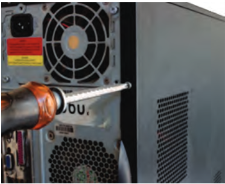
•	The computer comes with various types of cabinets. The method for opening the case is different based on the manufacturer.
•	To open the case, first remove the screws of the left side cover and slide the side cover .

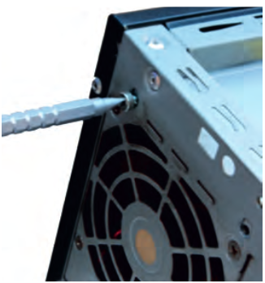

## Step 2 : Install the power supply
The next step is to install a power supply. There are usually four screws that attach the power supply to the case. Power supplies have fans that can vibrate and loosen screws that are not secured.
When installing a power supply, make sure that all of the screws are used and that they are properly tightened
•	Insert the power supply into the case.
•	Align the holes in the power supply with the holes in the case.
•	Secure the power supply to the case using the proper screws.

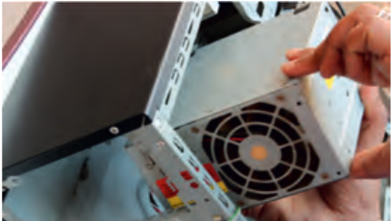

## Step 3: Attach the components to motherboard
The motherboard has to be prepared before its installation. To prepare the motherboard, you first need to install the CPU, then the heat sink on the CPU and CPU fan.
CPU
The CPU and motherboard are sensitive to electrostatic discharge. So place them on a grounded anti‑static mat and wear an anti‑static wrist strap while handling the CPU. When handling a CPU, do not touch the CPU contacts at any point. The CPU is secured to the socket on the motherboard with a locking assembly. 
Thermal compound which is used to conduct heat away from the CPU is applied on the top of CPU. In case of an old CPU, first clean the top of the CPU, and then apply the thermal compound. Clean the top of the CPU and the base of the heat sink with isopropyl alcohol and a lint‑free cloth. This removes the old thermal compound. Then apply a new layer of thermal compound .

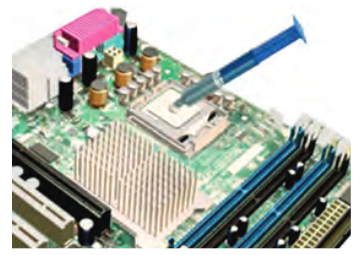

#### Heat sink and fan assembly
Heat sink and fan assembly is a two‑part cooling device. The heat sink draws heat away from the CPU. The fan moves the heat away from the heat sink. The assembly has a 3‑pin power connector.

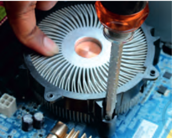

```
To install a CPU and heat sink and fan assembly, follow these steps:
•	First, open the CPU load plate. Align the CPU orientation so that the notches on the CPU are aligned with the orientation keys on CPU socket.
•	Place the CPU gently into the socket.
•	Close the CPU load plate.
•	Close the load lever.
•	Apply a small amount of thermal compound to top of the CPU .
•	Screw the CPU fan on the heat sink.
•	Align the heat sink and fan assembly with the holes on the motherboard.
•	Place the assembly onto the CPU socket carefully.
•	Screw the assembly on the motherboard 
•	Connect the assembly power cable to the CPU fan connector on the motherboard.

```

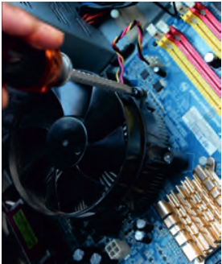

#### Installation of RAM
It is better to install the RAM first on the motherboard and then fix the motherboard in the case. To install RAM, first ensure its compatibility with the motherboard. If DDR3 is mentioned on the motherboard, then DDR3 RAM may be fixed in the memory slot. To install RAM, follow these steps.

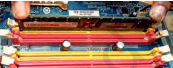
•	Press down the side locks of the memory slot . Align the notches on the RAM module to the keys in the slot and press down on both ends of RAM module until the side lock gets locked.
•	Make sure that the side tabs have locked the RAM module.
•	Repeat the above steps to install additional RAM modules.
## Step 4: Install motherboard 
After preparing the motherboard, you can install the computer case, as shown in Figure 12.10. Plastic and metal standoffs are used to mount the motherboard and to prevent it from touching the metal portions of the case. To install the motherboard, follow these steps:

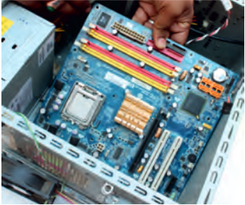

```
•	Lay the motherboard over the standoffs to mount it on the holes.
•	Align the screw holes of the motherboard with the standoffs.
•	Then screw the board using a standard screwdriver.
•	Tighten all the motherboard screws.
•	Connect the 4‑pin ATX power connector from the power supply to the motherboard.

```

## Step 5: Install internal drives
### Hard drive
The hard drive is the device which stores all the data. It is 3.5 inch wide and needs to be mounted so that access to the cable connections on the back is gained. Drives that are installed in internal bays are called internal drives. A hard disk drive (HDD) is an example of an internal drive. To install HDD, follow these steps:
```
•	Position the HDD so that it aligns with the 3.5 inch drive bay.
•	Insert the HDD into the drive bay so that the screw holes in the drive line up with the screw holes in the case .
•	Secure the HDD to the case using proper screws 
```
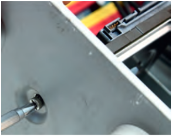
#### Optical drive
```

•	Position the optical drive so that it aligns with the 5.25 inch drive bay.
•	Insert the optical drive into the drive bay so that the optical drive screw holes align with the screw holes in the case .
•	Secure the optical drive to the case using the proper screws .
•	Connect the power cable coming from the SMPS to the power socket of optical drive.
•	Connect SATA data cable from optical drive socket to the motherboard socket.
```


## Step 6: Connect all internal cables 
Power cables are used to distribute electricity from the power supply to the motherboard and other components. Data cables transmit data between the motherboard and storage devices, such as hard drives.


## Step 7: Install motherboard power connections

Just like other components, motherboards require power to operate. The Advanced Technology eXtended (ATX) main power connector will have either 20 or 24 pins. The power supply may also have a 4‑pin or 6‑pin auxiliary (AUX) power connector that connects to the motherboard. A 20‑pin connector will work in a motherboard with a 24‑pin socket. Follow these steps for motherboard power cable installation:
```
•	Align the 20‑pin ATX power connector with the socket on the motherboard.
•	Gently press down on the connector until the clip clicks into place.
•	Align the 4‑pin AUX power connector with the socket on the motherboard.
•	Gently press down on the connector until the clip clicks into place . 
```
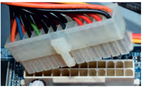

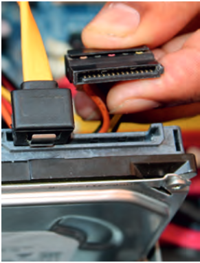

#### SATA power connectors
SATA power connectors use a 15‑pin connector . Serial advanced technology attachment (SATA) power connectors are used to connect to hard disk drives, optical drives, or any devices that have a SATA power socket.
## Step 8: Connect external cables to the computer
Setting up the computer system involves the complete process of establishing the proper connectivity of various parts of the computer system — input and output devices, connectivity of computer with the surge power supply. Reattach the side panels to the case. The process of connecting the external cables given below:

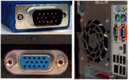

#### Locate the monitor cable
Locate the two power cable and one VGA cable or monitor cable (see Figure 12.21). The VGA cable is used to connect to monitor and another point on to the back side of the cabinet. If you are having trouble finding these, refer to the instruction manual of or the computer. You can skip to ‘Step 3’, in case of all‑in‑one computer that is built into the monitor.
#### Connecting monitor
Connect one end of the cable to the monitor port on the back of the computer case and the other end to the monitor. In case of VGA cable as shown in Figure 12.22 tighten the screws on the monitor cable to secure it. The cables will only fit in a specific way. If the cable does not fit, do not force it, otherwise the connectors might get damaged. Make sure the plug aligns with the port, then connect it. So, first identify all the cables, ports, and connectors.
#### Connecting keyboard


Unpack the keyboard and determine whether it uses a USB (rectangular) connector or a PS/2 (round) connector. If they have colour coded plugs that are light green and lavender, plug them into the corresponding colour‑coded ports, it is more likely if they use round PS/2 connectors. If it uses a USB connector, plug it into any of the USB ports on the back of the computer. 

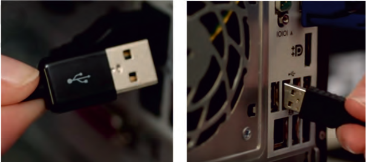

#### Connecting mouse
Unpack the mouse and determine whether it uses a USB or PS/2 connector. If it uses a USB connector, plug it into any of the USB ports on the back of the computer. If it uses a PS/2 connector, plug it into the green mouse port on the back of the computer. In case of wireless mouse or keyboard, connect a Bluetooth dongle (USB adapter) in one of the USB ports of the computer. However, it is not necessary to connect an adapter for the modern computers which have built‑in Bluetooth. 

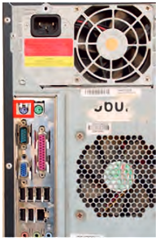

#### Connecting headphones or speakers, and microphone
Connect the external speakers or headphones, to computer’s audio port (either on the front or back of the computer case). The modern computers have colour‑ coded ports. Speakers or headphones connect to the green port, and microphones connect to the pink port. The blue port is the line‑in, which can be used with other types of devices. They can be also connected to the USB port. Some speakers, headphones, and microphones have USB connectors instead of the usual audio plug. Connect them to any USB port. Some computers have speakers or microphones built into the monitor.

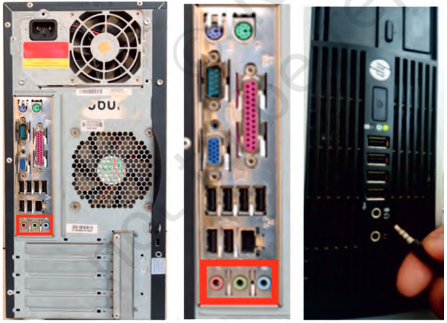

#### Connect the computer to a power supply
Locate the two power supply cables that came with the computer. Plug the first power supply cable into the back of the computer case and then into a surge protector. Then, using the other cable, connect the monitor to the surge protector. It is better to use an uninterruptable power supply (UPS), which acts as a surge protector and provides the back up when the power goes off.


#### Ups (uninterruptible power supply)
While working on computer, its power supply should not be interrupted. UPS is like a power bank which gives power to the computer system. So make sure to plug power cable of monitor and cabinet into the UPS power output socket. Ensure the connection is proper.
#### Plug the surge protector
Plug the surge protector into a wall outlet after finishing the connectivity of all the parts and peripherals, plug the surge protector into the main power supply. You may also need to turn on the surge protector if it has a power switch.
#### Connecting printer, scanner, webcam
To connect the peripherals such as printer, scanner, webcam, identify the respective connectors of the cable and port on the cabinet. Plug in the connectors of these peripherals in respective ports. Correctly plugging in will recognise the peripherals as they are plug and play devices. It may be required to install their software drivers for them to function properly. Use the instructions included with the device to install them if necessary. Installation of peripherals is optional, and it be can added at any time; it may not be required during the initial setup of your computer.
Checklist the following before starting the computer :
1. VGA cable of monitor is connected to the cabinet or not.
2. Power cable of monitor and cabinet has been plugged into the UPS power output socket. Make sure monitor is connected to the power supply or not.
3. Keyboard and mouse both are connected to their proper ports.

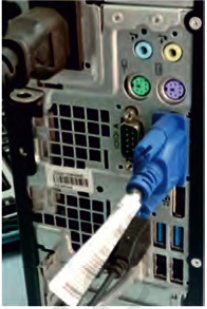

## Step 9: Starting the computer
To start the computer, it is necessary to follow the correct sequence to start up. Now push the power button on the CPU to start the computer. Practically when we start our vehicle, we always check that the light or air conditioner (AC) is off. Otherwise it will consume more power compared to normal start up.Always remember that the first step is to push power button of the CPU than the monitor’s. Because the monitor consumes more electricity when powered. Now your computer is ready to use.


# RESULT:
Thus the assembly of the system is performed in the following manner as mentioned in the procedure.